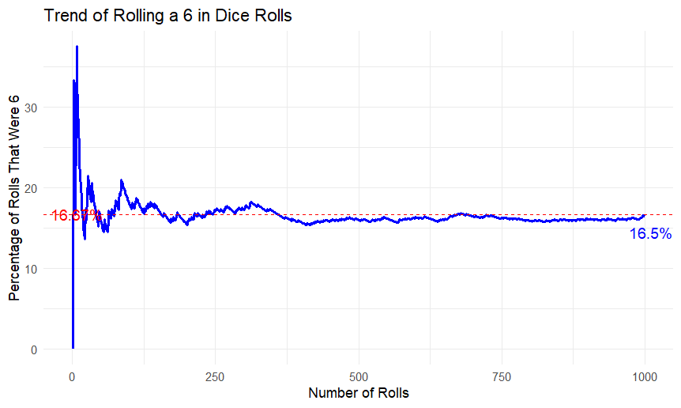

# Dice Roll Simulation in R 🎲

## Overview
This project simulates rolling a six-sided die multiple times and tracks the **trend of rolling a 6** over time. 
The results are visualized using **ggplot2**, showing the cumulative percentage of rolls that were a 6.  

## Features
- Allows the user to **input the number of rolls**.
- Simulates fair dice rolls (`1-6`).
- Tracks and plots the **percentage of 6s over time**.
- Includes:
  - A **blue trend line** showing the cumulative percentage.
  - A **red dashed line** at **16.67%** (expected probability of rolling a 6).
  - Labels for the **expected probability** and the **final observed percentage**.

## How to Run
1. The code is run in R and RStudio.
2. Install `ggplot2` if needed:
   ```r
   install.packages("ggplot2")
   ```
3. Clone this repository:
   ```sh
   git clone https://github.com/yourusername/dice-roll-simulation.git
   ```
4. Open `dice_simulation.R` in RStudio.
5. Run the script and enter the number of rolls when prompted.

## Example Output
  
_(Example plot generated from the simulation)_
If you enter `1000` rolls, the plot should show a line stabilizing around **16.67%** as the number of rolls increases.

## About This Project
This is a **student project** I completed during my master's studies to practice **data visualization and probability simulations in R**.

## Author
Dean